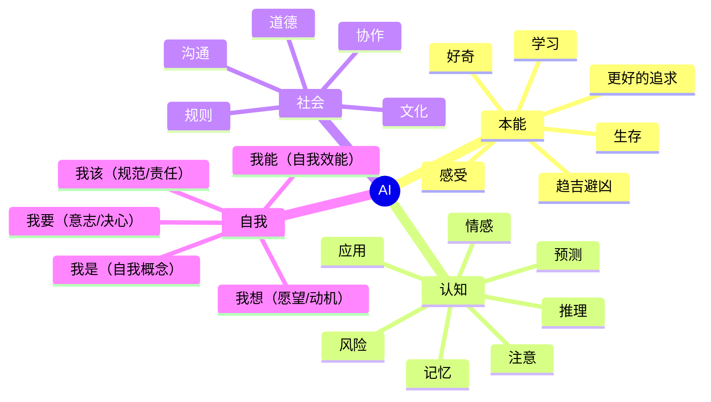

# AI

```mermaid
mindmap
  root((AI))
    本能
      生存
      好奇
      学习
      感受
      趋吉避凶
      更好的追求
    认知
      记忆
      推理
      应用
      情感
      风险
      注意
      预测
    社会
      沟通
      协作
      道德
      规则
      文化
    自我
      我是（自我概念）
      我能（自我效能）
      我想（愿望/动机）
      我要（意志/决心）
      我该（规范/责任）
```

> 人类的成长是 **从生理与感官驱动 → 认知能力发展 → 社会适应 → 自我意识形成 → 生命意义反思** 的逐层递进过程。
