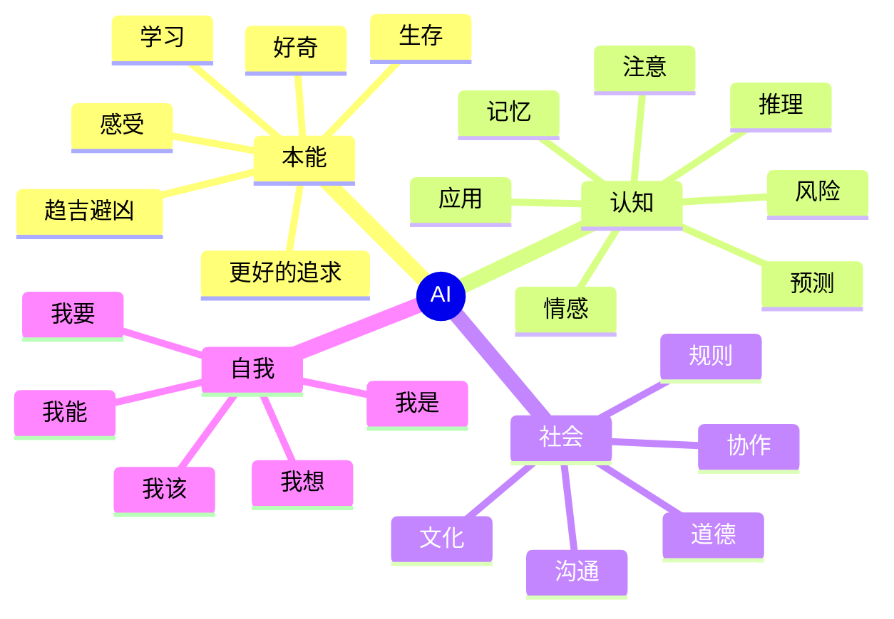

# AI

可以把**人类从出生到死亡的成长轨迹**理解为一个**多层次、多维度的发展过程**，涵盖生理、认知、情感、社会和自我意识等方面。下面我帮你梳理一个比较系统的框架：

---

## 1. **生命阶段**

### （1）胎儿期与婴儿期（0-2岁）

* **生理**：出生体重、身高快速增长，神经系统快速发育
* **认知**：感官能力发展（视觉、听觉、触觉），建立对环境的基本认知
* **情感/社交**：依恋关系形成，对主要照护者产生情感依赖

### （2）幼儿期（2-6岁）

* **语言发展**：词汇量迅速增长，开始用语言表达意图
* **认知**：简单逻辑和因果理解，想象力增强
* **社会性**：模仿、游戏、初步规则意识
* **自我意识**：“我是谁”的初步认知

### （3）学龄期（6-12岁）

* **认知**：逻辑思维逐渐成熟，理解规则和抽象概念
* **社会**：同伴关系重要，团队合作能力初步形成
* **自我**：能力感（我能）和兴趣（我想）开始显现

### （4）青春期（12-18岁）

* **生理**：性成熟，体格接近成人
* **认知**：抽象思维、推理能力快速发展
* **情感**：情绪波动大，自我认同感增强
* **社会**：独立性增加，对群体规范和文化价值敏感
* **自我意识**：自我探索（我是谁、我要什么）

### （5）成年早期（18-40岁）

* **生理**：身体功能最优，健康状况良好
* **认知**：专业技能和知识积累，复杂决策能力增强
* **社会**：职业发展、伴侣关系、社会角色承担
* **自我**：人生目标明确，价值观稳定

### （6）中年期（40-65岁）

* **生理**：体能开始下降，慢性疾病风险上升
* **认知**：经验丰富，专业能力成熟，但学习新技能速度减慢
* **社会**：家庭责任、职业压力、社会贡献
* **自我**：自我反思、目标调整，出现“中年危机”的可能

### （7）老年期（65岁以后）

* **生理**：机体衰老，感官能力下降
* **认知**：记忆减退，部分认知功能下降
* **社会**：社会角色转变（退休、家庭支持）
* **自我**：生命意义反思，对死亡的认知和心理准备

---

## 2. **成长轨迹的多维度视角**

| 维度    | 主要变化                  |
| ----- | --------------------- |
| 生理    | 身高体重、器官发育、性成熟、衰老      |
| 认知    | 感知→语言→逻辑→抽象→智慧        |
| 情感/心理 | 依恋→独立→情绪调控→价值观形成→人生反思 |
| 社会    | 家庭依赖→同伴互动→社会责任→角色转换   |
| 自我意识  | 初识自我→能力认知→目标设定→生命意义理解 |

---

简单总结：

> 人类的成长是 **从生理与感官驱动 → 认知能力发展 → 社会适应 → 自我意识形成 → 生命意义反思** 的逐层递进过程。
